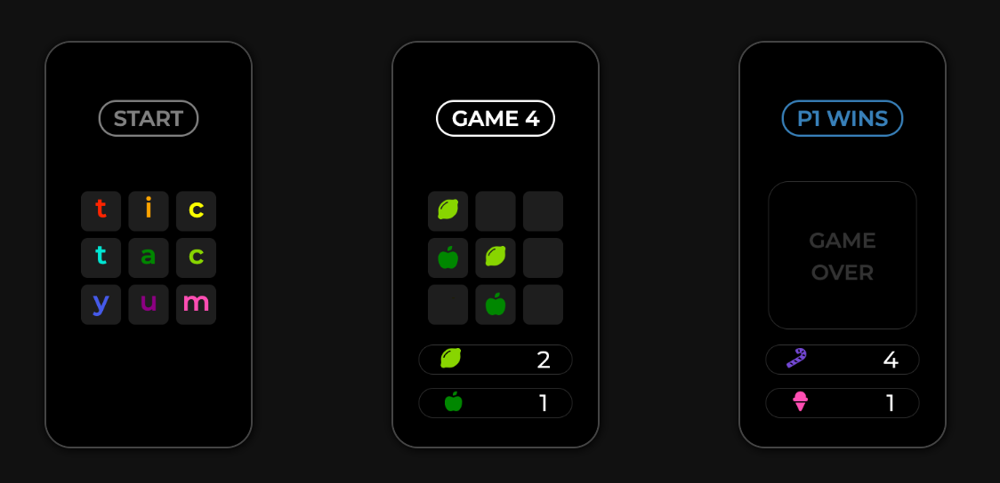
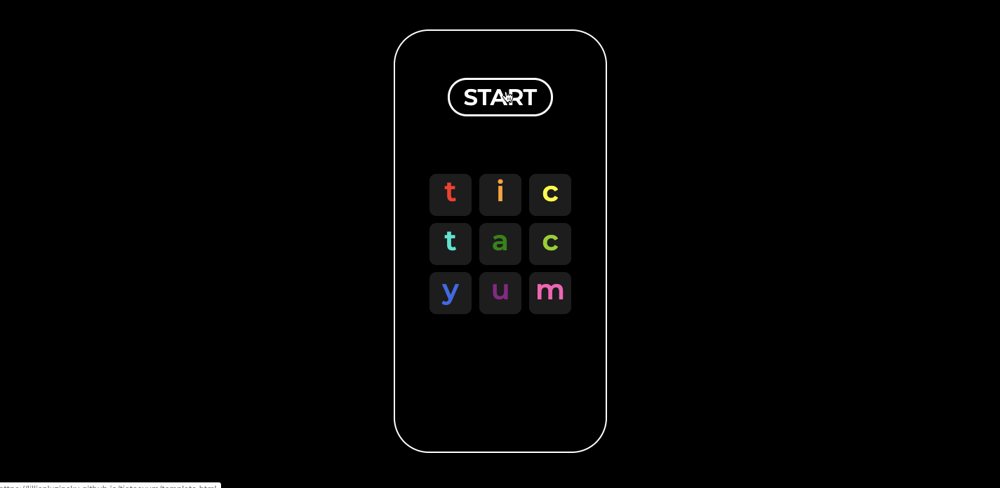

# Tic Tac Yum

## Deployment
  - https://lillianluzinsky.github.io/tictacyum/

---

## How it works
This is very similar to the common tic tac toe but instead of using circles and crosses, you use svg food icons as tokens. 

There are only 10 different icons for this game and there's a max of 5 games to be played. 
Each player is assigned 5 icons each, 1 icon per game. 

Each game also has a food theme:    game 1 (veggies);
                                    game 2 (animal products);
                                    game 3 (meats);
                                    game 4 (fruit);
                                    game 5 (lollies);

Each time you win a game, you go to the next game with 2 new food icons provided, 
until all 5 games have been played and won.

If there's a draw, your tokens automatically disappears and you're  allowed to continue the same game 
as many times until a player wins and go to the next game.

Once all 5 games have been completed, the game title changes indicating the player
that has won the most games. A button appears in the middle of the screen saying "Game Over". 
You may press this button to go back to the starting page if you would like to play again.

### Tic tac toe version 2 wishlist:

1) I would like to program tic tac toe using a 4x4 grid system instead of the usual 3x3.  
2) A 4x4 grid system would allow me to add different games whilst using the same design layout.  
3) First game you play with version 2, will be tic tac toe. 
Once you complete all 5 games, instead of "Game Over", 
it will display a button to go to the next game, which will be a memory game.  
4) When you complete 5 memory games, I would like to set up a puzzle type of game
where you slide the tokens to form an image.  
5) I would like to learn how to create a login system where 2 players need to sign in before playing.  
6) Each new game should have an instructions page.

---

## Used technologies:

1) HTML
2) CSS
3) JavaScript
4) JQuery

---

### Screenshots
   

---
